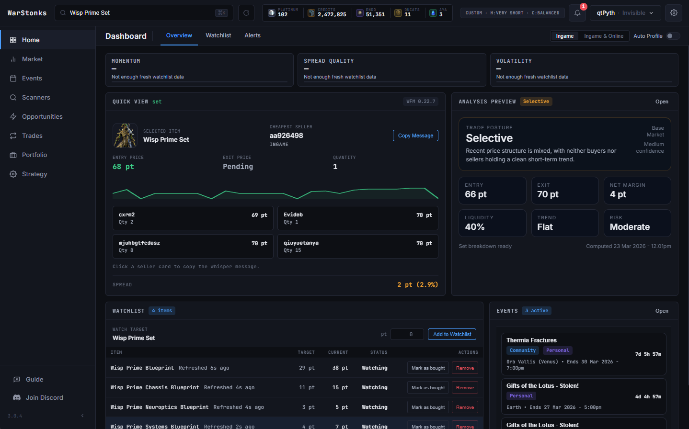
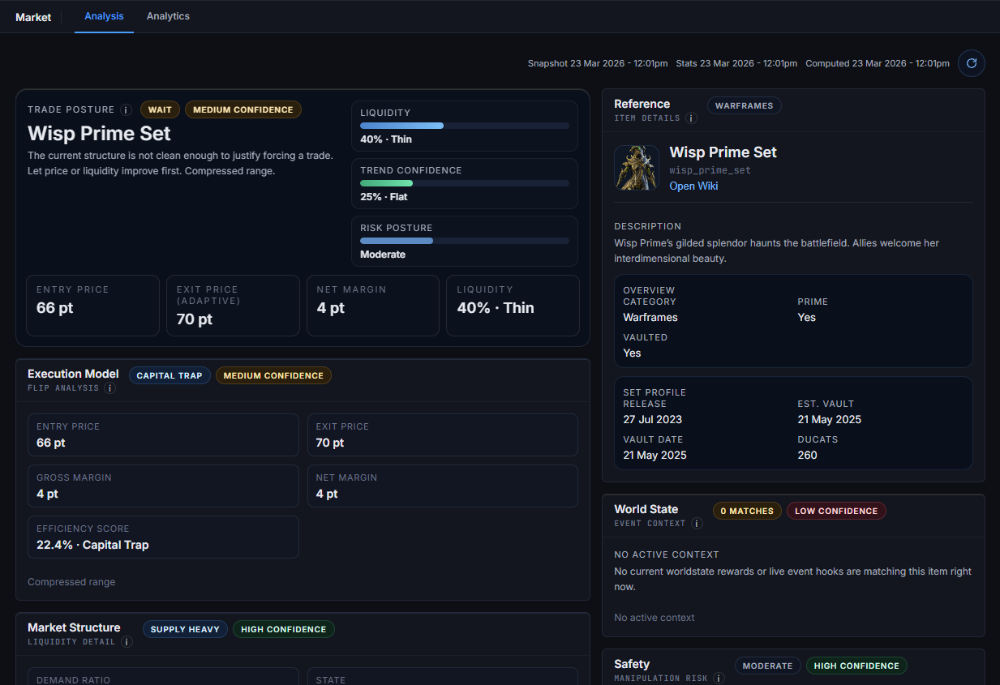
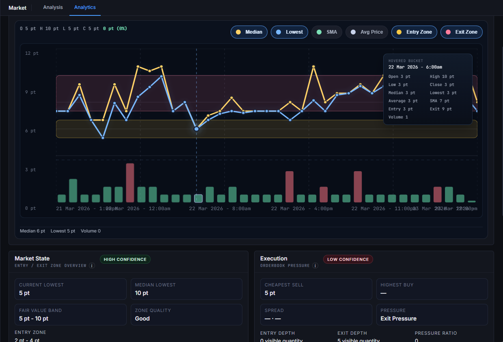
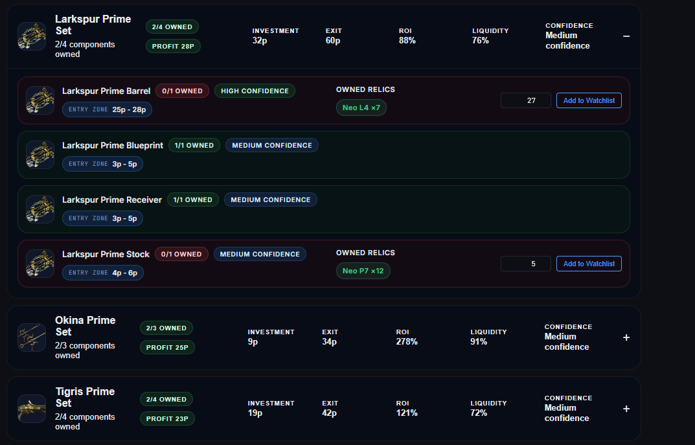
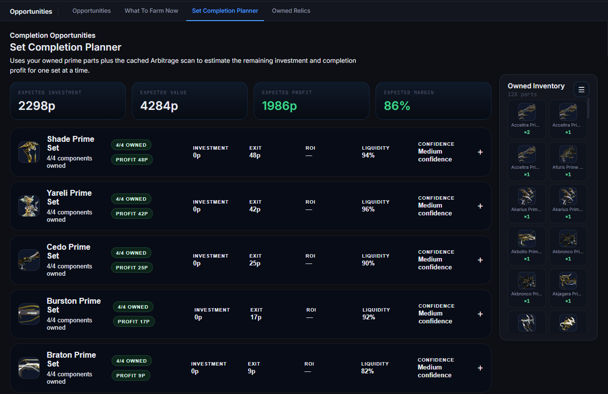
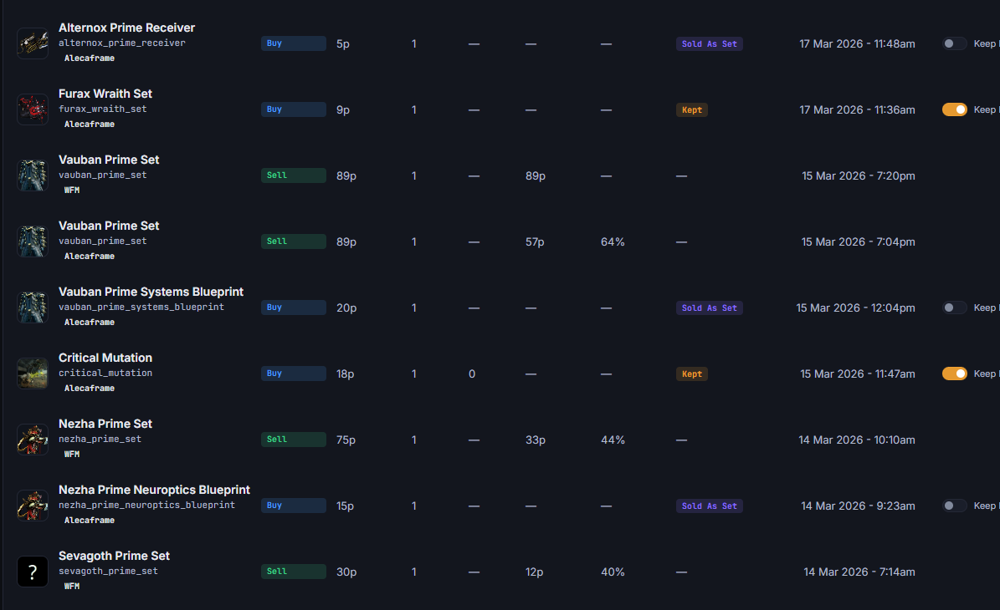
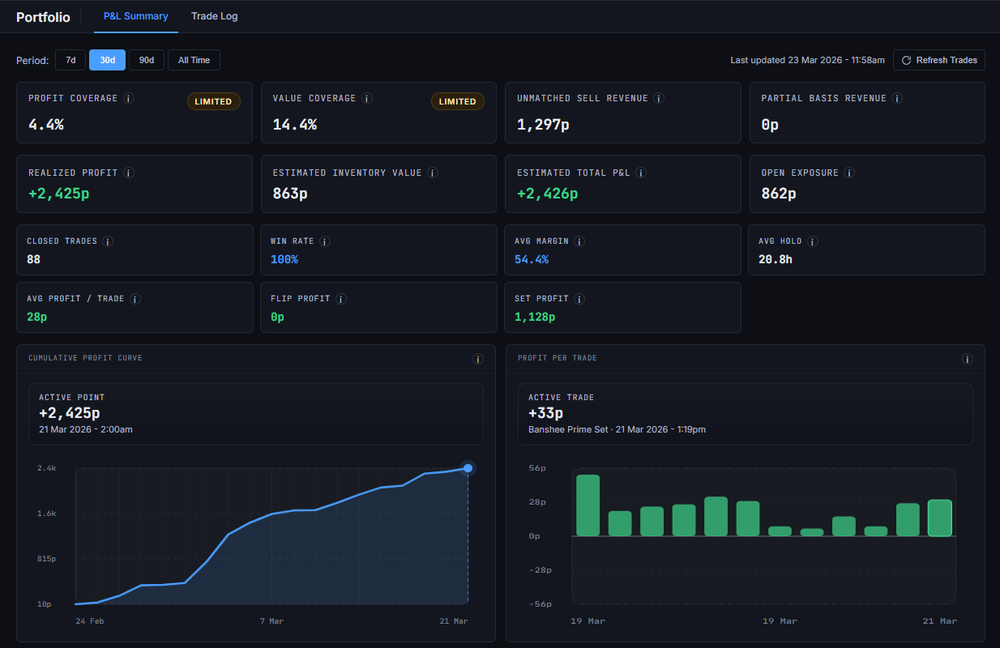

# WarStonks

> **WarStonks is free, open-source software** licensed under the [GNU GPL-3.0](LICENSE) — you're
> free to use, study, modify, and redistribute it under those terms. **However**, the name
> *"WarStonks"*, the *"py."* identity, and the project's branding/logos are **not** licensed: if
> you fork and redistribute a modified version, please **rename it** and don't present it as the
> official WarStonks or imply endorsement by py.
>
> ⚠️ **Only download official builds** from the [GitHub Releases](https://github.com/Py-xxx/WarStonks/releases)
> or [pyth.co.za](https://pyth.co.za). WarStonks signs into your Warframe.Market account — unofficial
> builds could be tampered with to steal credentials. See [`NOTICE.md`](NOTICE.md) and
> [`PRIVACY.md`](PRIVACY.md).

[](https://github.com/Py-xxx/WarStonks/releases)
[](LICENSE)
[](https://github.com/Py-xxx/WarStonks/releases)
[](https://tauri.app/)
[](https://warframe.market/)

WarStonks is a desktop trading companion for Warframe players who want to stop guessing and start making cleaner, faster market decisions.

It brings live market data, analysis, scanners, watchlists, relic/set planning, worldstate tracking, and portfolio tracking into one local-first app so you can see:

- what is worth flipping
- what is worth farming
- what is worth completing
- what your trades are actually doing over time

If you actively use Warframe.Market and want better timing, better visibility, and less manual checking, this app is built for that.



## Download

Download the latest version from [Releases](https://github.com/Py-xxx/WarStonks/releases).

For normal use:

- download the latest Windows installer (`.exe`)
- do not download the source-code zip
- install once, then let the app handle updates from there

WarStonks supports **in-app automatic updates**, so future versions are delivered directly through the app.

## What the app does

WarStonks is designed around practical decisions, not raw data dumps. It helps you:

- search and analyze items quickly, with entry/exit zones and execution quality
- run scanner-based opportunity discovery (arbitrage + relic ROI)
- catch underpriced live listings the moment they're posted
- manage a live watchlist with actionable, alertable buy targets
- plan set completion using your owned prime parts and relics
- manage your Warframe.Market buy/sell orders without losing context
- track your trade history and P&L locally
- stay on top of worldstate (vendors, fissures, Nightwave, Steel Path, open-world cycles)

Everything is **local-first**: your data lives on your machine in SQLite + local storage, and can be backed up or restored from **Settings → Import & Export**.

## Tabs

### Home
Your day-to-day trading dashboard — global item search, Quick View pricing (with a "View All" listing popup), watchlist management, and alert handling for the items you're actively monitoring.

### Market
The deep-dive page for a specific item, across three subtabs:
- **Summary** — headline pricing, entry/exit zones, liquidity & execution readouts, supply and drop-source context
- **Charts** — price history, the time-of-day liquidity heatmap, and analytics panels
- **Calibration** — confidence/accuracy diagnostics for the recommendations




### Events
Warframe worldstate in one place, with an always-visible **World Clock** for the open-world day/night cycles (Cetus, Vallis, Cambion):
- **Vendors** — Void Trader (Baro Ki'Teer) and the Prime Resurgence / Vault Trader. When Baro is in relay, WarStonks runs a one-time scan of his stock and shows each item's **recommended exit price**.
- **Fissures**
- **Activities**
- **Nightwave & Steel Path**
- **Events & News**

### Scanners
Bulk opportunity discovery — the **Arbitrage scanner** (set-versus-component opportunities) and the **Relic ROI scanner** (relic value and reward quality). Run these when you want the app to surface opportunities for you.

### Opportunities
Turns raw data into a next move:
- **What To Do Now** — a prioritized opportunity board (the Set Decision Engine: complete vs. sell-parts vs. farm)
- **What To Farm Now**
- **Underpriced Listings radar** — flags live market listings posted well below their recommended price
- accept ("pin") opportunities to keep them on top across recomputes




### Inventory
Your owned prime-part inventory, in two subtabs:
- **Set Completion Planner** — uses your owned parts + cached scan pricing to estimate the remaining investment and completion profit for a set
- **Inventory** — a searchable catalog to add/remove owned parts, each showing its **recommended exit value**, sortable by name or value, with a one-shot **Screenshot Import** to bulk-add parts

### Trades
Your Warframe.Market operations tab — buy orders, sell orders, listing health, and account status, with watchlist-linked order automation and automatic trade detection (Warframe.Market + Alecaframe). Mark items as "kept" to pull them out of P&L.



### Portfolio
Your local trade record and performance layer — the permanent trade ledger, realized profit, estimated inventory value, total P&L, win rate, and trade breakdowns. This is where you see whether your process is actually working.



### Strategy
Higher-level planning and trading-workflow tools.

### Guide
Built-in onboarding and help — searchable explanations of features, terms, and workflows.

## Settings

- **Alecaframe** — optional wallet/inventory sync and top-bar balances
- **Discord Webhook** — optional rich alerts for watchlist hits, detected trades, and underpriced listings
- **Notifications** — native desktop notifications + an in-app alert tone (selectable ringtones), with per-event toggles and an underpriced-discount threshold
- **Import & Export** — back up or restore your data as `.baddie` files (app data and the large market-snapshot cache are separate files); secrets like your webhook URL are never included

## Typical workflow

1. Search an item on Home or Market
2. Review the analysis and current market posture
3. Add it to your watchlist if the setup is good
4. Let alerts (in-app, desktop, or Discord) surface the moment it's actionable
5. Use Trades to manage orders
6. Use Portfolio to measure results
7. Use Scanners / Opportunities to find the next edge

## Developer notes

WarStonks is a Tauri 2 desktop app built with React 18, TypeScript, Rust, and bundled SQLite. It integrates the Warframe.Market and warframestat.us APIs, and optionally Alecaframe.

```bash
pnpm install
pnpm tauri dev      # run the full app (requires the Rust toolchain)

pnpm test           # frontend tests (Node test runner)
pnpm run test:rust  # Rust tests
```

Releases are published through GitHub Releases; for users the install artifact is the Windows `.exe`. 
