# WarStonks

**Stop guessing. Trade Warframe's market like you mean it.**

WarStonks is a free, open-source desktop companion that turns Warframe.Market from a
price-checking chore into an edge: live analysis with entry/exit zones, scanners that find
profitable set flips for you, a watchlist that pings you the moment your price hits, a board
that literally tells you *what to do next* — and a local ledger that proves whether your
trading actually works.

[](https://github.com/Py-xxx/WarStonks/releases)
[](LICENSE)
[](https://github.com/Py-xxx/WarStonks/releases)
[](https://tauri.app/)
[](https://warframe.market/)
[](#)

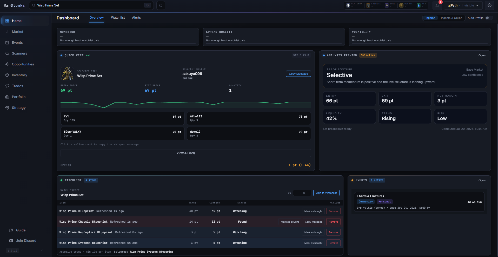

> **WarStonks is free, open-source software** licensed under the [GNU GPL-3.0](LICENSE) — use,
> study, modify, and redistribute it under those terms. The name *"WarStonks"*, the *"py."*
> identity, and the project's branding/logos are **not** licensed: if you fork and redistribute
> a modified version, please rename it and don't present it as official.
>
> ⚠️ **Only download official builds** from [GitHub Releases](https://github.com/Py-xxx/WarStonks/releases)
> or https://pyth.co.za/apps/warstonks. WarStonks signs into your Warframe.Market account —
> unofficial builds could be tampered with to steal credentials. See [`NOTICE.md`](NOTICE.md)
> and [`PRIVACY.md`](PRIVACY.md).

## Download

Grab the latest Windows installer (`.exe`) from
**[Releases](https://github.com/Py-xxx/WarStonks/releases)** or
**[pyth.co.za/apps/warstonks](https://pyth.co.za/apps/warstonks)** — install once and the app
updates itself from there. (Skip the source-code zip unless you're building it yourself.)

## Why WarStonks?

Warframe trading rewards the player with better information and better timing. Getting either
normally means a dozen browser tabs, spreadsheet math, and refreshing listings by hand.
WarStonks does all of it, continuously, on your machine:

- **It tells you what a fair price actually is.** Every item gets recommended entry/exit
  zones, liquidity and trend readouts, and a confidence rating — not just "current lowest
  seller".
- **It finds the plays for you.** Scanners sweep the entire market for set-arbitrage and relic
  ROI; the Opportunities board ranks your best moves — complete this set, sell those parts,
  snipe that underpriced listing — with the profit math already done.
- **It watches so you don't have to.** Watchlist targets refresh continuously and alert you
  in-app, on your desktop, or in Discord the moment a price is hit — even while you're
  in-mission with the app minimized.
- **It keeps score.** Every trade lands in a local ledger with realized profit, win rate, and
  inventory value — so you know if your strategy makes plat or just feels like it does.
- **Your data stays yours.** Local-first by design: everything lives in SQLite on your PC,
  with one-click backup/restore. No accounts, no telemetry, no cloud.

## The tour

### Know the price before you whisper — *Home & Market*

Search any item and get an instant Quick View: cheapest sellers, spread, a one-click whisper
message, and an analysis preview with trade posture, entry/exit, margin, liquidity, trend, and
risk. Dive deeper in Market for full price history, a time-of-day liquidity heatmap, and
calibration diagnostics that show how trustworthy the recommendations are.

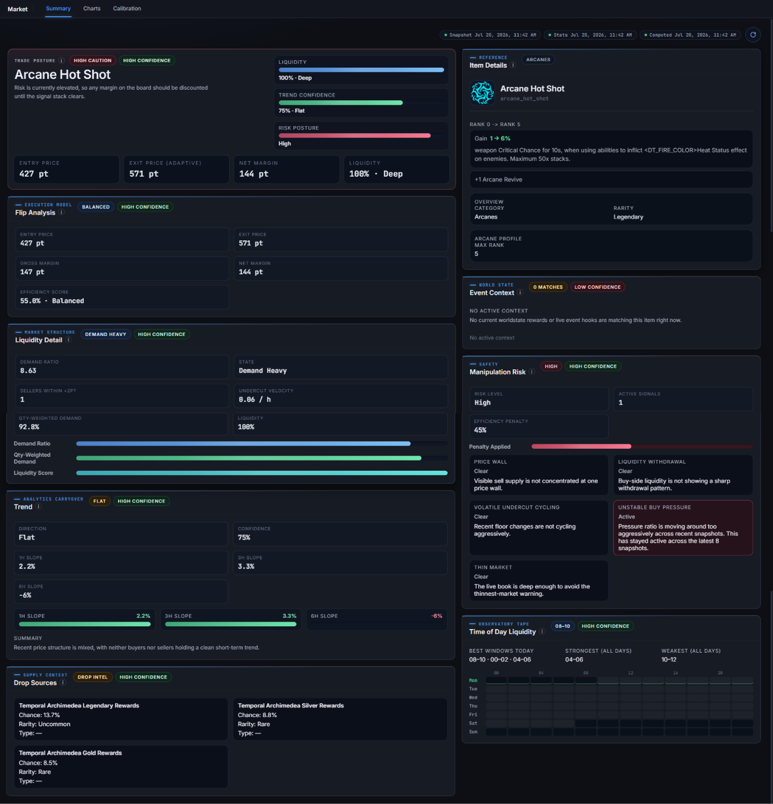
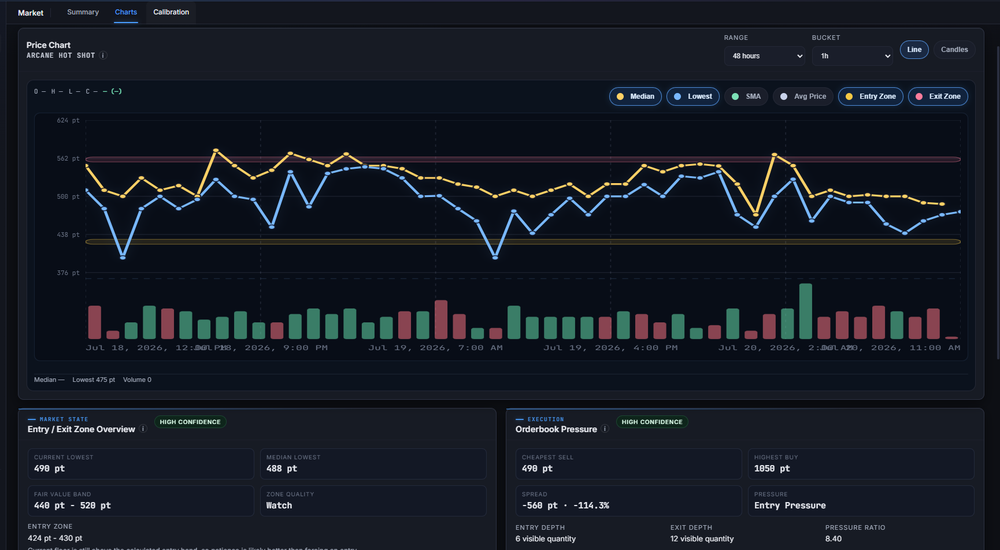

### Let the app do the waiting — *Watchlist & Notifications*

Set a target price and walk away. WarStonks scans your watchlist around the clock, marks items
**Found** when a listing hits your number, and fires native desktop notifications, in-app
alert tones, or rich Discord webhooks — your choice, per event type.

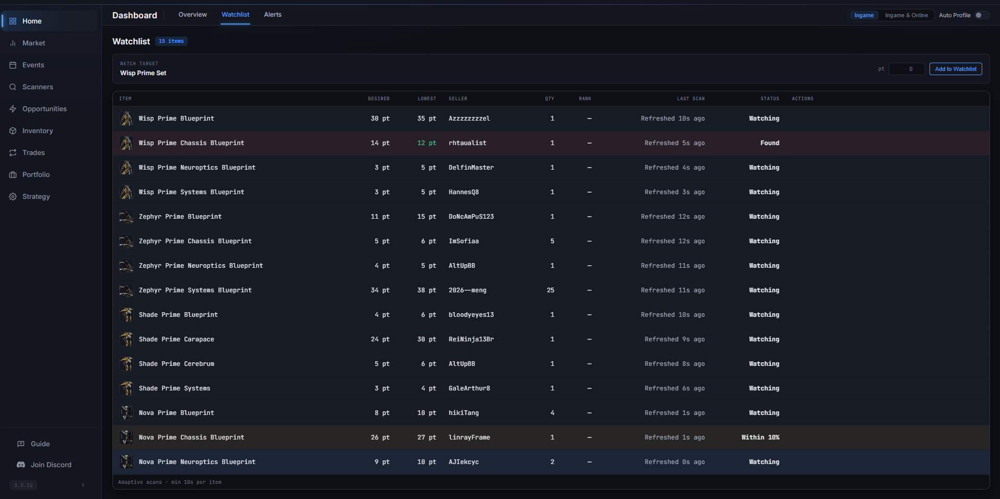
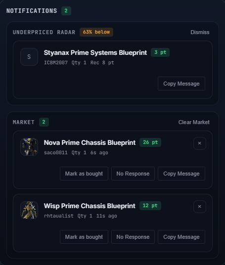

### Find the plays you'd never spot by hand — *Scanners & Opportunities*

The Arbitrage scanner prices every prime set against its parts across the whole market; the
Relic ROI scanner does the same for relics. Then the **What To Do Now** board turns it all
into ranked, one-click moves: *complete Destreza Prime for +114p*, *your Nekros set isn't
worth finishing — sell the parts for +67p*, *snipe this listing at 50% under its usual
entry*. Each card shows its reasoning, confidence, and the exact buys/sells to make.

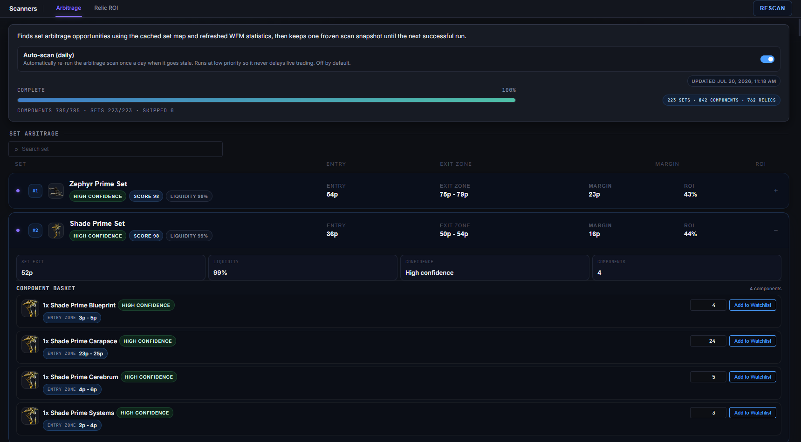
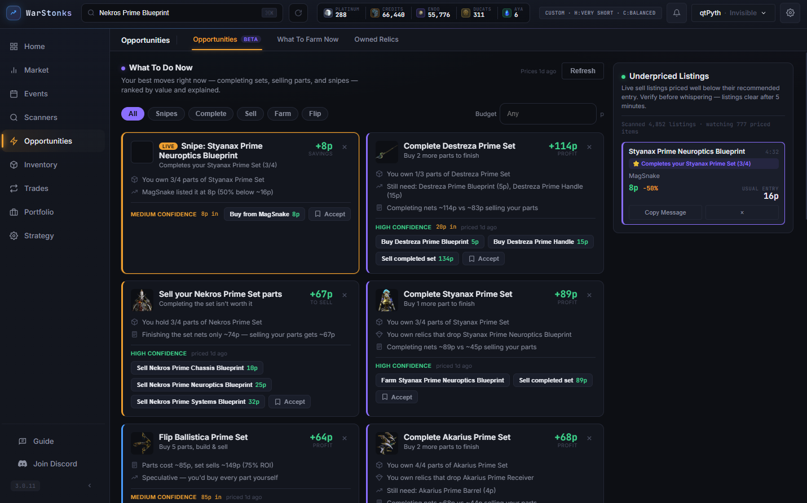

**What To Farm Now** goes one step further and cross-references your *owned relics* — telling
you which farm actually pays out given what's already in your inventory.

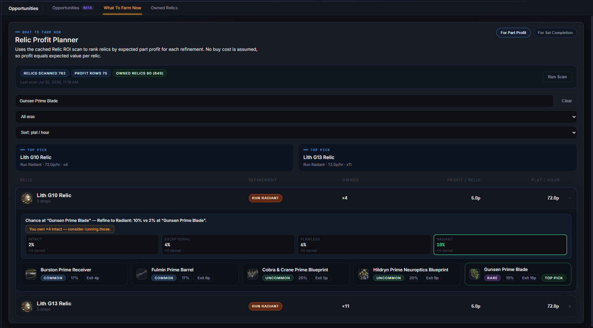

### Turn your part pile into plat — *Inventory*

Track your owned prime parts (bulk-import them with a screenshot), and the Set Completion
Planner prices out every set you're sitting on: what the missing parts cost, what the
completed set sells for, and whether finishing or selling wins.

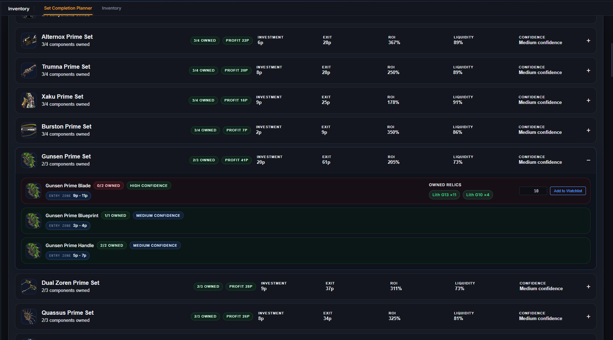

### Run your shop without the tab-juggling — *Trades*

Manage your Warframe.Market sell and buy orders in place — with per-item rank and variant
handling, bulk arcane batching, and live market context next to every listing. Trades are
detected automatically (via Warframe.Market and optionally AlecaFrame), and the **Listing
Health** view flags orders that have drifted from the market so stale prices never cost you a
sale.

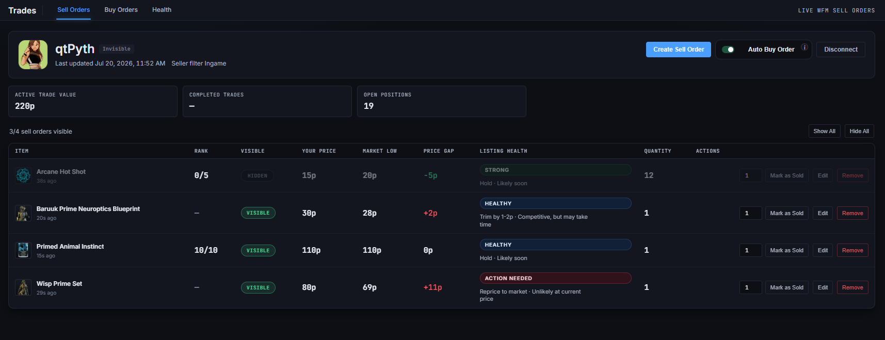
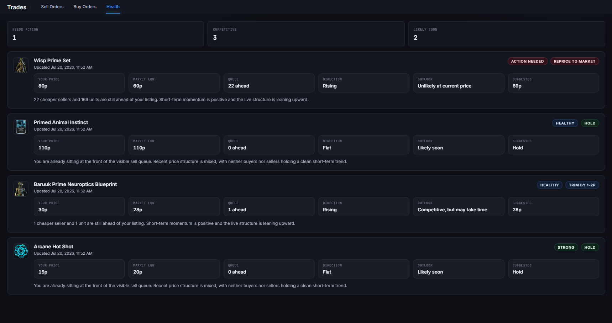

### Know if you're actually winning — *Portfolio*

A permanent local trade ledger with realized P&L, win rate, average margins, and estimated
inventory value. Group trades, mark items as "kept" to exclude them from profit math, and see
your performance over any period. This is where "I think I'm profitable" becomes a number.

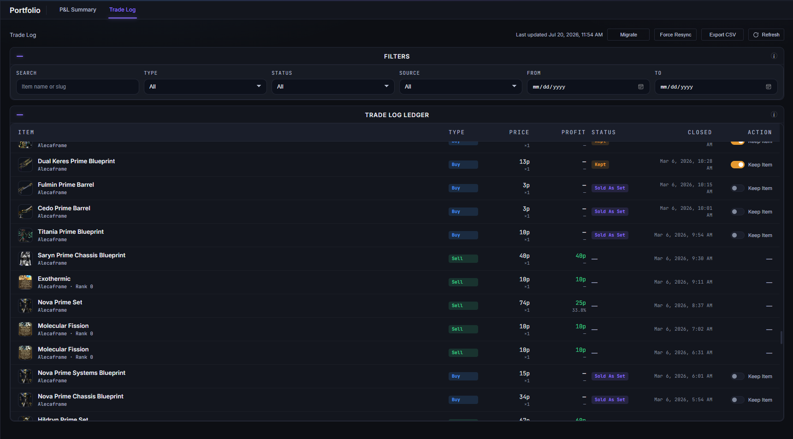
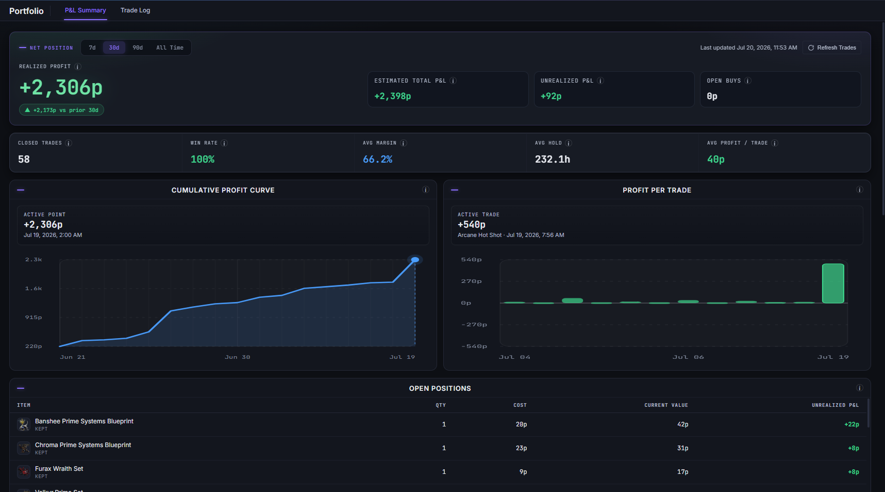

### And the rest

- **Events** — the full worldstate at a glance: Baro Ki'Teer (with exit-price analysis of his
  stock while he's in relay), Prime Resurgence, fissures, Nightwave, Steel Path, and a world
  clock for the open-world cycles.
- **Six languages** — English, Deutsch, Español, Français, Português, 简体中文 — with item
  names straight from Warframe.Market's official translations.
- **AlecaFrame integration** *(optional)* — live wallet balances in the top bar, owned-relic
  sync, and automatic in-game trade detection.
- **Import & Export** — back up or move your entire setup as a single file; secrets are never
  included.
- **Built-in Guide** — searchable in-app explanations of every feature and term.

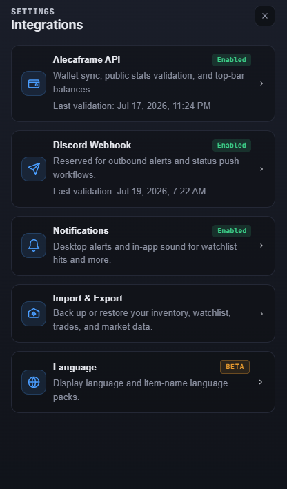

## A typical session

1. **Scan** — run the arbitrage scanner (or let daily auto-scan do it) and open Opportunities.
2. **Act** — accept the plays worth taking; the app pre-fills the buys, sells, and whispers.
3. **Watch** — put slower setups on the watchlist and go play; alerts find you.
4. **Settle** — detected trades flow into the Portfolio ledger on their own.
5. **Review** — check P&L and win rate, adjust, repeat.

## For developers

WarStonks is a Tauri 2 app — React 18 + TypeScript on the front, Rust + SQLite on the back —
integrating the Warframe.Market and warframestat.us APIs (and optionally AlecaFrame). All API
access is rate-limited and coalesced to stay well within each service's rules.

```bash
pnpm install
pnpm tauri dev      # full app (requires the Rust toolchain)

pnpm test           # frontend tests (Node test runner)
pnpm run test:rust  # Rust tests
```

Contributions, bug reports, and feedback are welcome — the fastest way to reach us is the
**Join Discord** button in the app.
